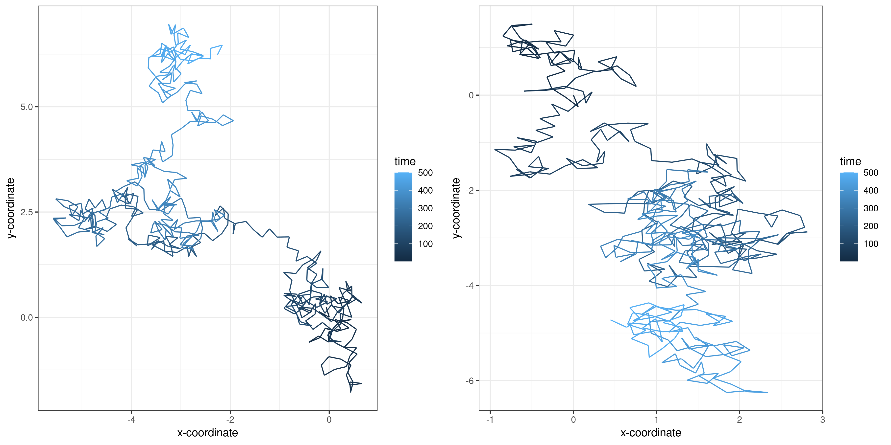
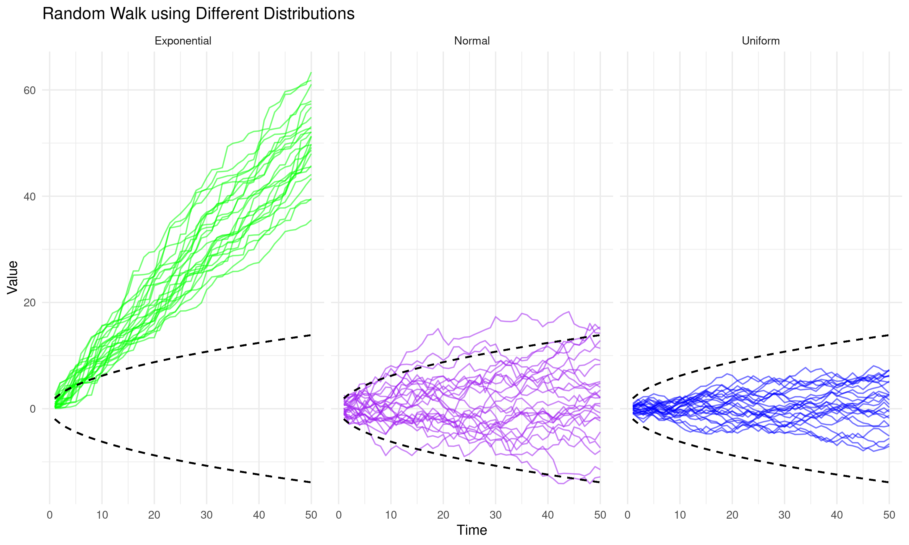
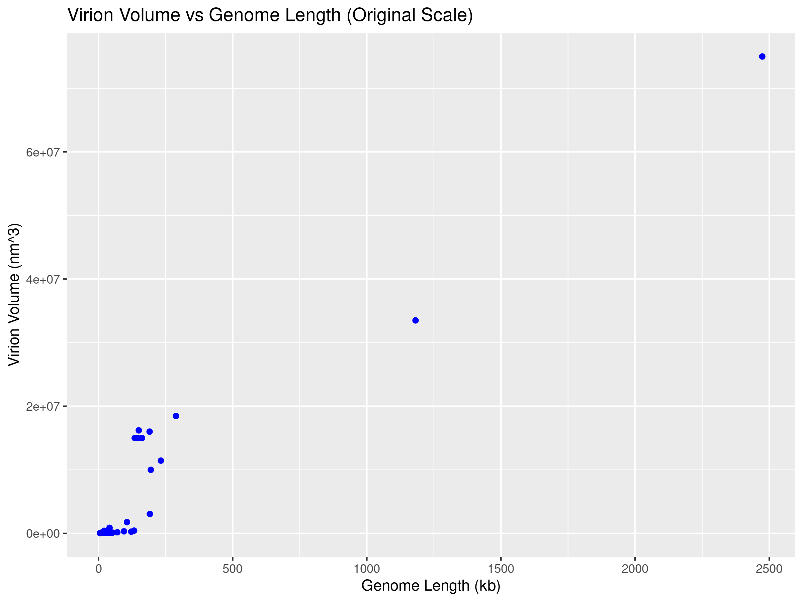
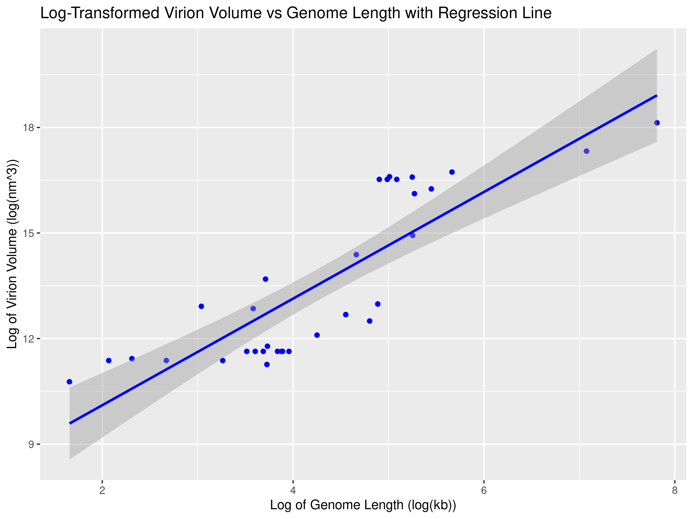

# Reproducible research: version control and R

\# INSERT ANSWERS HERE #
## Question 1, 2, 3
https://github.com/deepminer142/logistic_growth/tree/main

## Question 4
### a. 
#### Looking at the code
- random_walk function simulates a two-dimensional random walk in space. 
- random_walk takes n_steps (the number of steps the random walk will take).
- random_walk takes h (here 0.25 units) size steps.
- The root of the walk is (0, 0).
- Therefore, at time = 1, the position is (x = 0, y = 0).
- random_walk moves next step in a random angle.
- Random angle is generated from a uniform distribution between 0 and 2π.
- The new x and y for each step is based on the previous position and the random angle.
- cos(angle) x h = Δx
- sin(angle) x h = Δy

#### Looking at the graph
- All walks start at (0, 0), the root I set.
- Then the walk move at each time step to another vertex.
- In an unweighted random walk, the vertex of the walk is chosen uniformly at random among the neighbours.
- When you re-run the code no two graphs are the same because of the randomness of angle.
- It is a stochastic process.
- The walk's path show clusters then spreading. This pattern may be because short movements in random directions accumulate in certain areas, causing these local clusters.
- This is expected observation for Brownian motion which is a continuous time stochastic process (Mörters and Peres, 2001)

### b. 
- Random seed is used to initialize a pseudorandom number generator (Bethard 2022).
- The number sequence completely determined by the seed.
- Therefore, if later initialized with same seed it will produce same number.
- This allows for the graph to be reproducible.
- Setting a random seed allows you to produce the same "random" result every time you rerun the code with the same seed.
- This is essential to produce reprodicble research.

### c. 
- To make a reproducible stimulation of Brownian motion I have set seed to 123

### d. 
- Edit made in code                    

### Extended
### Brownian motion and Biology
- Brownian motion is essentially the random motion of particles in liquid or gas medium. It is a passive motion of diffusion of particles. 
- This is applicable to biological systems in its simplest form, for example, when botanist Robert Brown first discovered it whilst observing the erratic motion of small pollen grains (Ebeling and Schweitzer, 2003).
- A key example of this is during morphogenesis in development. A gradient of morphogens forms during early development to programme different cell types in distinct spatial order, for example giving rise to vertebrate limb development (Ebeling and Schweitzer, 2003).
- Another example is during protein sorting, specifically in post-translation protein translocation. The precursor moves back and forth by Brownian motion in the translocation channels. Then mt-Hsp70 binds trapping the segment in the matrix. Step-wise binding promotes further import until the precursor is completely transported into the matrix (Fanner and Meijer, 1995).
- These two examples highlight the application of using Brownian motion to understand biological systems.
  
### Extending the random walk
- In the previous random walk I used a uniform distribution.
- I was curious to see what happens to the walk when I use other types of distribution.
- I adapted the code from (Sanderson, 2024) to look at random walks using uniform, normal and exponential distribution. 
- I found that the normal one shows more fluctuations (than uniform) in both directions, because it produces balanced steps around a mean of zero.
- In contrast, the exponential one moves upwards dramatically as exponential distributions are positive.

## Question 5
### a. 
- Rows = 13 (Family, Genus, Type species, GenBank accession no, Envelope, Virion type, T, Virion diameter (nm), Virion length (nm), Virion volume (nm×nm×nm), Molecule, Genome length (kb), Protein no)
- Columns = 33  dsDNA virsues

### b. 
- To testing the allometric relationship between virion volume and genome length I need to transform to log scale (log-log transformation).
- This coverts non-linear relationship into a linear one and so you can fit a linear regression model.

### c. 
- Intercept = 7.0748
- Scaling factor (alpha) = exp(7.0748) = **1181.807 (95% CI)**
- Exponent (Slope) (β) = **1.5152 (95% CI)**
- This means volume increases by the 1.5152 power of length.
- Allometric relationship can be expressed as Virion Volume = 1181.807 × (Genome Length)1.5152
- The p-value for the intercept (7.0748) = 2.28×10-10
- The p-value for the genome length coefficient = 2.28×10-10
- 2.28×10-10 and 2.28×10-10 are below significance level (0.05)
- Therefore, these **coefficients are statistically significant**.
- The exponent in paper = 1.52 (1.16-1.87) (95% CI)
- Scaling factor in paper = 1,182 (246–5,675) (95% CI)
- I have the **same values** for both the exponent and scaling factor

### d.
### e.

## References 
1. Bethard, S. (2022) ‘We need to talk about random seeds  ’, IACAPAP ArXiv [Preprint]. doi:10.48550/arXiv.2210.13393.
2. Ebeling, W. and Schweitzer, F. (2003) ‘Self-Organization, Active Brownian Dynamics, and Biological Applications’, Nova Acta Leopoldina NF, 88(332), pp. 169–188. doi:10.48550/arXiv.cond-mat/0211606. 
3. Fanner, N.P. and Meijer, M. (1995) ‘Protein sorting: Pulling in the proteins’, Current Biology, 5(2), pp. 132–135. doi:10.1016/s0960-9822(95)00033-9. 
4. Mörters, P. and Peres, Y. (2001) Brownian motion [Preprint]. doi:10.1017/cbo9780511750489.
5. Steven P. Sanderson II, M. (2024) Exploring random walks with tidydensity in R, Steve’s Data Tips and Tricks. Available at: https://www.spsanderson.com/steveondata/posts/2024-07-11/ (Accessed: 15 November 2024). 
