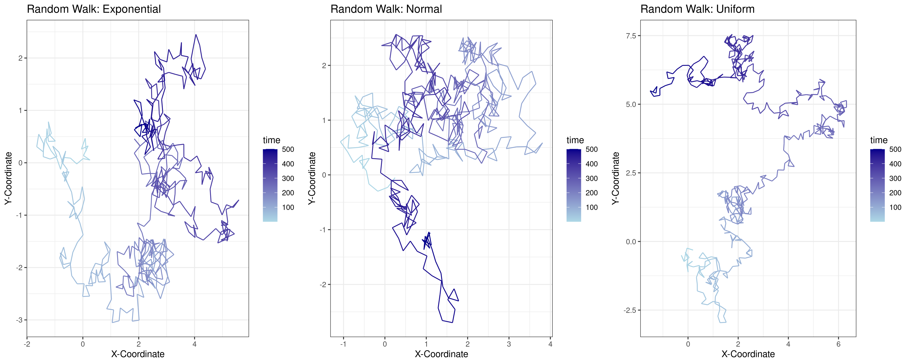

# Reproducible research: version control and R

\# INSERT ANSWERS HERE #
## Question 1, 2, 3
https://github.com/deepminer142/logistic_growth/tree/main

## Question 4
### a.
*Two-paneled graph showing two independent random walks in two-dimensional space*

<p style="color:red; text-align:center;">
  
</p>

This script produces a two-paneled graph showing two independent random walks in two-dimensional space. The x-axis represents the x-coordinates, and the y-axis represents the y-coordinates. The graph on the left displays a greater range of x-coordinates (ranging from -4 to 3) and y-coordinates (ranging from -7 to 0), while the graph on the right has smaller range of range of x-coordinates (ranging from -2 to 3) and y-coordinates (ranging from -5 to 0). Both walks begin at the origin (x = 0, y = 0), referred to as the root, which is explicitly set in the script. At time t = 1, the starting position for is x = 0, y = 0. In an unweighted random walk, the vertex of the walk is chosen uniformly at random from among its neighbors. Each walk consists of 500 steps, with each step being 0.25 units in size. The gradient of the line, transitioning from dark to light blue, represents an increase in the number of steps and, consequently, the passage of time. The walk progresses to the next step at a random angle, generated from a uniform distribution between 0 and 2π. The new x and y coordinates for each step are calculated based on the previous position and the random angle, using the formulas:

$$
\Delta x = \cos(\text{angle}) \times h, \quad \Delta y = \sin(\text{angle}) \times h
$$

Due to the randomness of the angle, re-running the code produces unique graphs each time, making it a stochastic process. The paths of the walks exhibit both clustering and spreading, likely caused by short movements in random directions accumulating in specific areas, forming local clusters. This behavior aligns with expectations for Brownian motion, a continuous-time stochastic process (Mörters and Peres, 2001).

### b. 
A random seed is used to initialize a pseudorandom number generator (Bethard, 2022). The number sequence is completely determined by the seed, meaning that if the generator is later initialized with the same seed, it will produce the same sequence of numbers. This ensures that the graph is reproducible. By setting a random seed, you can consistently produce the same "random" results each time you rerun the code with the same seed. This is essential for generating reproducible research, as it allows others to replicate the results exactly.


### c. 
*Code showing two reproducible independent random walks in two-dimensional space*
```{r}
random_walk  <- function (n_steps, seed = NULL) {
set.seed(seed)
  df <- data.frame(x = rep(NA, n_steps), y = rep(NA, n_steps), time = 1:n_steps)
  
  df[1,] <- c(0,0,1)
  
  for (i in 2:n_steps) {
    
    h <- 0.25
    
    angle <- runif(1, min = 0, max = 2*pi)
    
    df[i,1] <- df[i-1,1] + cos(angle)*h
    
    df[i,2] <- df[i-1,2] + sin(angle)*h
    
    df[i,3] <- i
    
  }
  
  return(df)
  
}


data1 <- random_walk(500, seed = 123)
plot1 <- ggplot(aes(x = x, y = y), data = data1) +
  
  geom_path(aes(colour = time)) +
  
  theme_bw() +
  
  xlab("x-coordinate") +
  
  ylab("y-coordinate")


data2 <- random_walk(500, seed = 132)
plot2 <- ggplot(aes(x = x, y = y), data = data2) +
  
  geom_path(aes(colour = time)) +
  
  theme_bw() +
  
  xlab("x-coordinate") +
  
  ylab("y-coordinate")

grid.arrange(plot1, plot2, ncol=2)
```

*Two-paneled graph showing two reproducible independent random walks in two-dimensional space*

<p style="color:red; text-align:center;">
  
</p>
  


### d. 

*An image to show the changes made to code to make two reproducible independent random walks in two-dimensional space*


### Extended
#### Brownian motion and biology
Brownian motion is essentially the random motion of particles in liquid or gas medium. It is a passive motion of diffusion of particles. This is applicable to biological systems in its simplest form, for example, when botanist Robert Brown first discovered it whilst observing the erratic motion of small pollen grains (Ebeling and Schweitzer, 2003). A key example of this is during morphogenesis in development. A gradient of morphogens forms during early development to programme different cell types in distinct spatial order, for example giving rise to vertebrate limb development (Ebeling and Schweitzer, 2003). Another example is during protein sorting, specifically in post-translation protein translocation. The precursor moves back and forth by Brownian motion in the translocation channels. Then mt-Hsp70 binds trapping the segment in the matrix. Step-wise binding promotes further import until the precursor is completely transported into the matrix (Fanner and Meijer, 1995). These two examples highlight the application of using Brownian motion to understand biological systems.
  
#### Extending the random walk
In the previous random walk, I used a uniform distribution. I was curious to see what happens to the walk when other types of distributions are used. I adapted the code from Sanderson (2024) to examine random walks generated using uniform, normal, and exponential distributions. I found that the exponential distribution produces an uneven walk due to its sudden movements. In contrast, the normal distribution results in a walk that is more evenly spread in all directions, as it produces balanced steps around a mean of zero. Finally, the uniform walk appears as discussed in Part 4a.

*Reproducible stimulation using different distributions*


## Question 5
### a. 
Columns = 13 (Family, Genus, Type species, GenBank accession no, Envelope, Virion type, T, Virion diameter (nm), Virion length (nm), Virion volume (nm×nm×nm), Molecule, Genome length (kb), Protein no)

Rows = 33  dsDNA virsues

### b. 
To test the allometric relationship:

$$
V = \beta L^{\alpha}
$$ 

Between virion volume and genome length I need to transform to log scale (log-log transformation).

*Code to show log transformation performed*
```{r}
log_transform <- data %>%
  mutate(genome_length_log = log(Genome.length..kb.),
         virion_volume_log = log(Virion.volume..nm.nm.nm.))
```

*Graph to show the log transformation of genome length vs virion volume*


This coverts non-linear relationship into a linear one:

$$
\ln(V) = \ln(\beta) + \alpha \ln(L)
$$

Therefore, I can fit a linear regression model (y = mx + c)
 
### c. 

*The model output:*


#### Using values from the model output
α = 1.5152

ln(β) = 7.0748, so β = exp<sup>7.0748</sup> = 1181.807

The p-value for the intercept = 2.28×10<sup>-10</sup>, which is <0.001, therefore it is statistically significant at a level of p < 0.001.

The p-value for α = 6.44×10<sup>-10</sup>, which is <0.001, therefore it is statistically significant at a level of p < 0.001.
  
#### The paper values:
α = 1.52 (1.16-1.87) (95% CI)

β = 1,182 (246–5,675) (95% CI)

Therefore, I have the **same values** for both the exponent and scaling factor

### d.

*Code to reproduce*

```{r}
# For Question 5, part d
# Step 1: Load ggplot2 if not already loaded
install.packages("ggplot2")
library(ggplot2)

# Step 2: Create a linear model with the log-transformed data
virus_model <- lm(virion_volume_log ~ genome_length_log, data = log_transform)

# Step 3: Plot
volume_length_comparison_plot <- ggplot(log_transform, aes(x = genome_length_log, y = virion_volume_log))  + 
  geom_point(color = "black") +                           
  geom_smooth(method = "lm", color = "blue", se = TRUE) + 
  xlab("log [Genome length (kb)]") +                      
  ylab("log [Virion volume (nm3)]") +                    
  theme_bw() +                                            
  theme(text = element_text(size = 14))         

# Step 5: Display plot
print(volume_length_comparison_plot)

# Step 6: Save plot as PNG
ggsave("volume_length_comparison.png", plot = volume_length_comparison_plot, width = 8, height = 6, dpi = 300)
```
*Recreated graph from (Cui et al., 2014)*


### e.
As I have fitted the data to the linear model:

$$
\ln(V) = \ln(\beta) + \alpha \ln(L)
$$

Now I subsitute the known values in:

$$
\ln(V) = 7.0748 + 1.5152 \times \ln(L)
$$

To estimate volume (V) for a virus with a genome length (L) of 300 kb:

$$
\ln(V) = 7.0748 + 1.5152 \times \ln(300)
$$

$$
\ln(V) = 15.7172
$$

$$
**V = 6,697,006.58**
$$


## References 
1. Bethard, S. (2022) ‘We need to talk about random seeds  ’, IACAPAP ArXiv [Preprint]. doi:10.48550/arXiv.2210.13393.
2. Ebeling, W. and Schweitzer, F. (2003) ‘Self-Organization, Active Brownian Dynamics, and Biological Applications’, Nova Acta Leopoldina NF, 88(332), pp. 169–188. doi:10.48550/arXiv.cond-mat/0211606. 
3. Fanner, N.P. and Meijer, M. (1995) ‘Protein sorting: Pulling in the proteins’, Current Biology, 5(2), pp. 132–135. doi:10.1016/s0960-9822(95)00033-9. 
4. Mörters, P. and Peres, Y. (2001) Brownian motion [Preprint]. doi:10.1017/cbo9780511750489.
5. Steven P. Sanderson II, M. (2024) Exploring random walks with tidydensity in R, Steve’s Data Tips and Tricks. Available at: https://www.spsanderson.com/steveondata/posts/2024-07-11/ (Accessed: 15 November 2024). 
